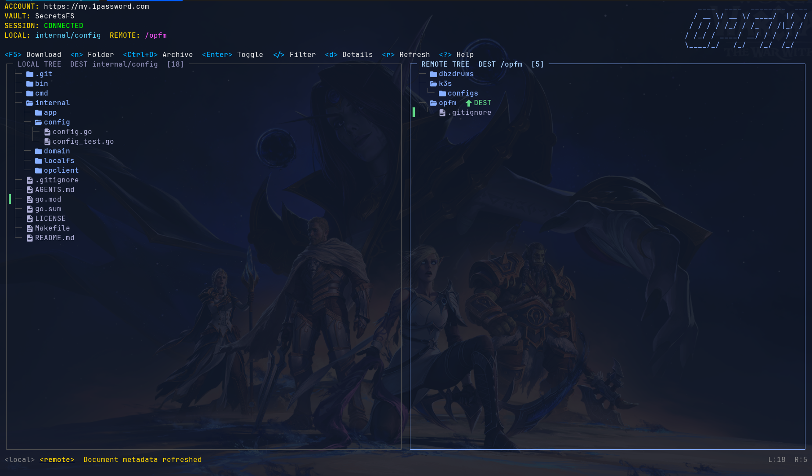
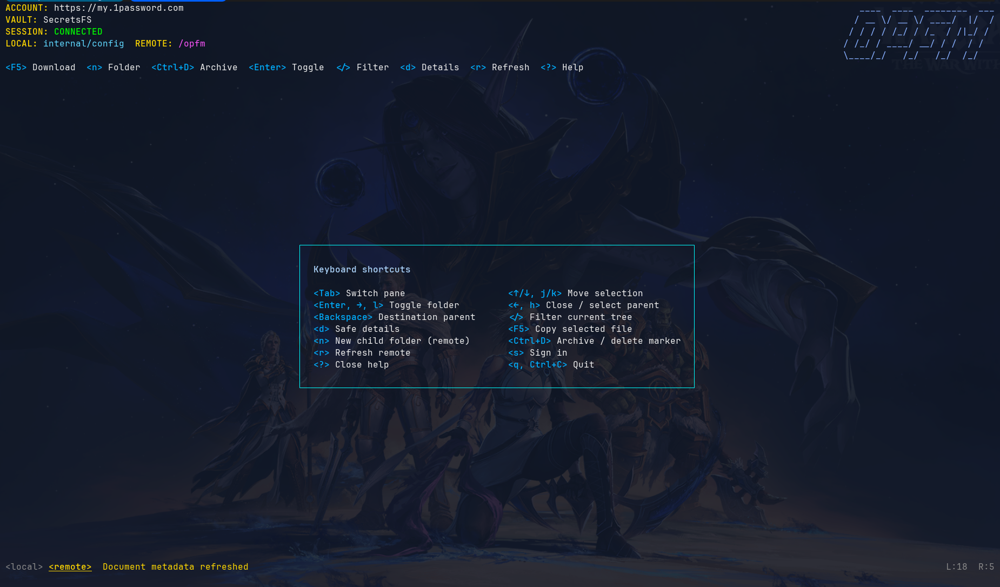

# opfm

**A keyboard-first terminal file manager for 1Password Documents.**

`opfm` puts a local filesystem tree beside a virtual tree backed by one
1Password vault. It is intended for sensitive project files such as `.env`
files, Kubernetes configurations, certificates, and API-key material: browse
where the file belongs, then transfer it deliberately without exposing its
contents in the interface.





> [!WARNING]
> opfm is an early-stage project. Treat remote uploads, downloads, archival,
> and folder-marker removal as real changes to your 1Password data.

## Why opfm?

The 1Password CLI can already store and retrieve Documents, but its document
titles are a flat namespace. `opfm` gives those titles a file-manager workflow:

- navigate a project directory and a vault side by side;
- arrange remote Documents into an intuitive folder tree;
- choose destinations instead of encoding a remote path in a local filename;
- upload or download one selected regular file at a time; and
- keep file contents out of listings, previews, status messages, and logs.

The interface is deliberately keyboard-oriented and inspired by tools such as
terminal file managers and Kubernetes TUIs: persistent context, compact action
hints, visible panes, and a shortcut overlay when needed.

## Quick start

### Requirements

- Linux
- Go 1.25 or newer
- [1Password CLI (`op`)](https://developer.1password.com/docs/cli/)
- A 1Password account that can create and read Documents in the chosen vault

### Build and configure

```sh
git clone https://github.com/debonzi/op-file-manager.git
cd op-file-manager
go build -o opfm ./cmd/opfm

# Choose an existing vault or create one during setup.
./opfm init
```

Start `opfm` in the directory you want to browse locally:

```sh
./opfm
# or
./opfm /path/to/project
```

If 1Password has not been authenticated for the current process, press `s` in
the TUI. `opfm` delegates authentication to `op` and requests the normal
1Password CLI sign-in flow.

### Install a release

Every stable GitHub release includes Linux `amd64` and `arm64` archives plus a
`checksums.txt` file. Replace the version and architecture below as needed:

```sh
VERSION=v1.0.0
ARCH=amd64
BASE="https://github.com/debonzi/op-file-manager/releases/download/${VERSION}"

curl -LO "${BASE}/opfm_${VERSION}_linux_${ARCH}.tar.gz"
curl -LO "${BASE}/checksums.txt"
sha256sum -c checksums.txt
tar -xzf "opfm_${VERSION}_linux_${ARCH}.tar.gz"
install -m 0755 "opfm_${VERSION}_linux_${ARCH}/opfm" ~/.local/bin/opfm
```

Release binaries show their version in the bottom-right status bar. Builds made
without an injected version show `dev`.

## How the remote tree works

1Password Documents are the source of truth. `opfm` maps a slash-separated
Document title to a virtual relative path:

```text
Document title                 Shown in opfm
-----------------------------  ---------------------------
projects/api/.env              projects/
                                └── api/
                                    └── .env
clusters/staging/config.yaml   clusters/
                                └── staging/
                                    └── config.yaml
```

Folders that contain Documents are inferred. When you create an otherwise
empty remote folder with `n`, opfm stores a small tagged **directory marker**
Document so the folder persists. Markers are hidden from normal browsing and
can only be permanently removed when they are empty and you confirm the action.

This means the remote side behaves like a hierarchy without pretending that
1Password itself is a POSIX filesystem.

## Everyday workflow

1. Start in (or pass) your local project directory.
2. Use `Tab` to focus the local or remote pane, then navigate to the desired
   file and remote destination folder.
3. Press `F5` to transfer the selected local file to the remote destination,
   or the selected remote Document to the local destination.
4. Confirm destructive operations. Remote Document deletion is archival;
   empty folder-marker deletion is permanent after confirmation.

The most useful shortcuts are always shown in the action bar. Press `?` for the
complete in-app reference.

| Key | Action |
| --- | --- |
| `Tab` | Switch active pane |
| `↑`/`↓` or `j`/`k` | Move selection |
| `Enter`, `→`, or `l` | Expand/collapse a folder; select it as the active destination |
| `←` or `h` | Collapse the folder or select its parent |
| `Backspace` | Make the destination its parent folder |
| `F5` | Copy the selected file between panes |
| `n` | Create a remote folder marker |
| `Ctrl+D` | Archive a remote Document or remove an empty folder marker |
| `/` | Filter the current tree, preserving matching ancestors |
| `d` | Show safe metadata for the selected Document |
| `r` | Refresh remote metadata |
| `s` | Sign in to 1Password |
| `?` | Open/close keyboard help |
| `q` or `Ctrl+C` | Quit |

## Safety and privacy

- `internal/opclient` is the only part of opfm that executes the `op` CLI.
- The TUI never reads, previews, prints, or logs Document contents.
- Uploads accept regular local files only. Symlinks are refused.
- Downloads are created with restrictive permissions and avoid unsafe symlink
  replacement.
- The local browser is scoped to the root passed when starting opfm.
- Account and vault identifiers are stored in XDG configuration; session tokens
  remain only in process memory and are cleared when opfm exits.

These choices reduce accidental disclosure, but they do not replace your
organization's secret-management practices or a review of each transfer.

## Configuration and authentication

`opfm init` writes configuration under the XDG configuration directory (usually
`~/.config/opfm`). It stores only the selected 1Password account and vault IDs.
It can also create a new vault during setup.

For authentication, opfm honors the selected account and a valid CLI session
when one exists. Otherwise, `s` invokes the regular 1Password CLI sign-in
process. It never persists the resulting session token.

## Current scope

opfm currently focuses on the narrow, safer workflow of individual file
transfers between a local directory tree and 1Password Documents. In particular:

- it is a Linux TUI, not a mounted filesystem;
- it manages one configured vault at a time;
- it does not preview or edit secret contents; and
- virtual folders are represented by title prefixes and optional marker
  Documents.

Feedback, bug reports, and contributions that keep those safety boundaries
clear are welcome.

## Development

Run the full validation suite before submitting a change:

```sh
go test ./...
go test -race ./...
go vet ./...
go build ./cmd/opfm
```

To inject a version in a local binary, use `make build VERSION=v1.2.3`.

For interactive checks, run the built binary inside `tmux`. Never include
session tokens, passwords, document contents, or other secret material in
issues, logs, tests, screenshots, or commit messages.

## License

See [LICENSE](LICENSE).
